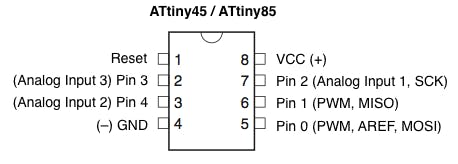
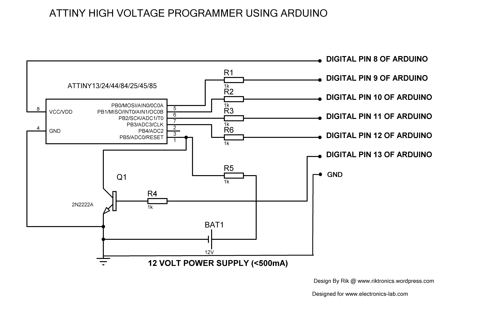

# tooth_tunes_hack

* http://www.grandideastudio.com/wp-content/uploads/toothtunes_slides.pdf


Notes
* Petit FAT filesystem (http://elm-chan.org/fsw/ff/00index_p.html)
  * only pertains to the embedded side
    * the SD card itself can be formatted to:
      * FAT12, FAT16 and FAT32
* Converting MP3/etc to correct audio format (WAV format (Microsoft RIFF), 8/16-bit, mono, 8-48kHz)
  * http://elm-chan.org/works/sd8p/report.html
  * I only tried:
    * 8-bit mono, 8000kHz
      * `ffmpeg -i input.mp3 -acodec pcm_u8 -ac 1 -ar 8000 output.wav`
        * PCM unsigned 8-bit
        * I didn't try `s8              PCM signed 8-bit` ... but now I wonder if it would improve the audio quality
  * 16-bit, 16 kHz
    * `ffmpeg -i input.mp3 -acodec pcm_s16le -ac 1 -ar 16000 output.wav`
      * PCM signed 16-bit little-endian
  * https://trac.ffmpeg.org/wiki/audio%20types

-- Programming hex file --
* I didn't recompile, just used what Joe Grand provided
  * sudo avrdude -P /dev/ttyACM0 -c avrisp -b 9600 -p t85 -U flash:w:sd8p_mo.hex:i
```
avrdude: AVR device initialized and ready to accept instructions

Reading | ################################################## | 100% 0.05s

avrdude: Device signature = 0x1e930b (probably t85)
avrdude: NOTE: "flash" memory has been specified, an erase cycle will be performed
         To disable this feature, specify the -D option.
avrdude: erasing chip
avrdude: reading input file "sd8p_mo.hex"
avrdude: writing flash (6374 bytes):

Writing | ################################################## | 100% 8.80s

avrdude: 6374 bytes of flash written
avrdude: verifying flash memory against sd8p_mo.hex:
avrdude: load data flash data from input file sd8p_mo.hex:
avrdude: input file sd8p_mo.hex contains 6374 bytes
avrdude: reading on-chip flash data:

Reading | ################################################## | 100% 5.84s

avrdude: verifying ...
avrdude: 6374 bytes of flash verified

avrdude: safemode: Fuses OK (E:FF, H:DF, L:62)

avrdude done.  Thank you.
```
  * sudo avrdude -P /dev/ttyACM0 -c avrisp -b 9600 -p t85 -V -U lfuse:w:0xe1:m -U hfuse:w:0x7d:m
```
avrdude: AVR device initialized and ready to accept instructions

Reading | ################################################## | 100% 0.05s

avrdude: Device signature = 0x1e930b (probably t85)
avrdude: reading input file "0xe1"
avrdude: writing lfuse (1 bytes):

Writing | ################################################## | 100% 0.06s

avrdude: 1 bytes of lfuse written
avrdude: reading input file "0x7d"
avrdude: writing hfuse (1 bytes):

Writing |                                                    | 0% 0.00s ***failed;  
Writing | ################################################## | 100% 0.16s

avrdude: 1 bytes of hfuse written

avrdude: safemode: hfuse changed! Was 7d, and is now 5d
Would you like this fuse to be changed back? [y/n] y
^C

```

Issues encountered
* avrdude invalid device signature
  * Solutions considered:
    * Arduino ISP to ATTiny85 connection issue?
      * this seemed to be the issue, changed the Arduino ISP code to use `d10` for `SS` (also see the table below, I was using a Leonardo)
      * got code changes for using alternate pins from here:
        * https://www.instructables.com/id/Arduino-Leonardo-as-Isp/
    * Default fuses from manufacturer expect 16MHz crystal?
      * built a high-voltage fuse resetter
        * HV programmer reset fuses to(LFUSE: 6A  HFUSE: FF)
          * http://www.engbedded.com/fusecalc/  -- says 6A and FF are
        * schematic based on this site's image (also shown below with Arduino ISP connections in Red, for clarity when it comes to actual program code flashing)
          * http://www.electronics-lab.com/recover-bricked-attiny-using-arduino-as-high-voltage-programmer/
          * https://arduinodiy.wordpress.com/2015/05/16/high-voltage-programmingunbricking-for-attiny/

-- SPI Connections --
* from https://www.arduino.cc/en/Reference/SPI
The following table display on which pins the SPI lines are broken out on the different Arduino boards:

|Arduino / Genuino Board | MOSI          | MISO          | SCK          | SS (slave) | SS (master) | Level|
|------------------------|---------------|---------------|--------------|------------|-------------|------|
|Uno or Duemilanove      | 11 or ICSP-4  | 12 or ICSP-1  | 13 or ICSP-3 | 10         | -           | 5V   |
|Mega1280 or Mega2560    | 51 or ICSP-4  | 50 or ICSP-1  | 52 or ICSP-3 | 53         | -           | 5V   |
|Leonardo                | ICSP-4        | ICSP-1        |  ICSP-3      |  -         | -           | 5V   |
|Due                     | ICSP-4        | ICSP-1        |  ICSP-3      |  -         |4,10,52      | 3,3V |
|Zero                    | ICSP-4        | ICSP-1        |  ICSP-3      |  -         |-            | 3,3V |
|101                     | 11 or ICSP-4  | 12 or ICSP-1  |  13 or ICSP-3|    10      |10           | 3,3V |
|MKR1000                 | 8             | 10            | 9            |   -        |-            | 3,3V |

Note that MISO, MOSI, and SCK are available in a consistent physical location on the ICSP header; this is useful, for example, in designing a shield that works on every board.


-- Actual connections used --

| ATTiny85   | Arduino Leonardo|
|------------|-----------------|
|MISO  pin 6 |  ICSP pin MISO  |
|MOSI  pin 5 |  ICSP pin MOSI  |
|SCK   pin 7 |  ICSP pin SCK   |
|RESET  pin1 | digital pin 10  |
| GND        |  GND            |
| Vcc        |  5v             |



